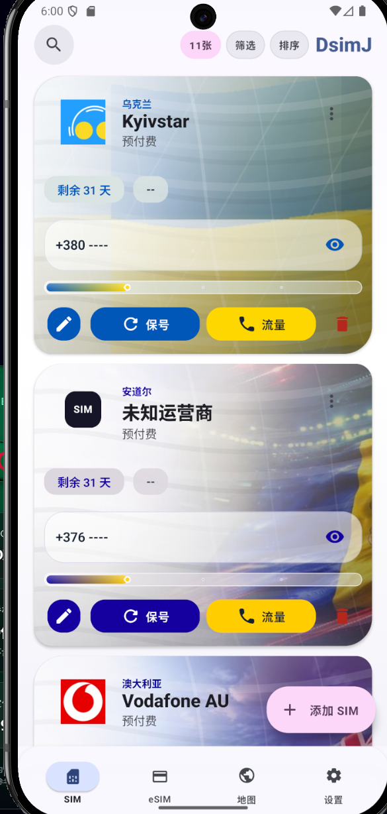
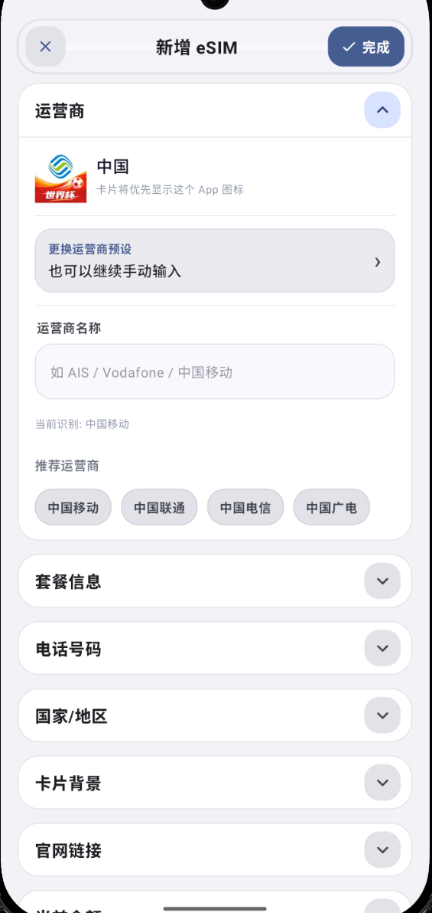
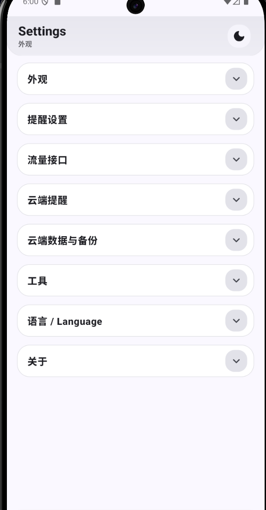
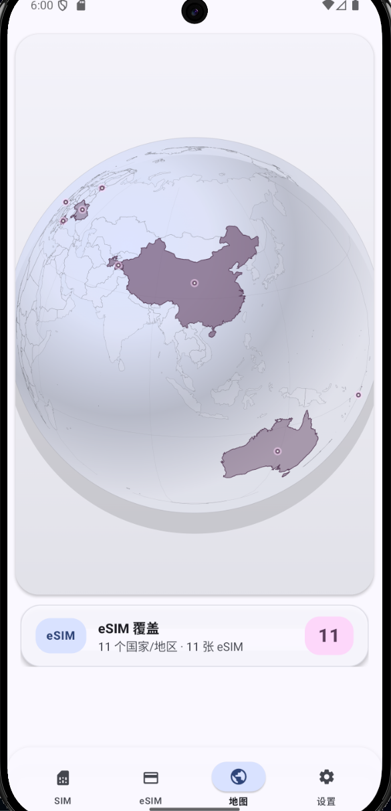
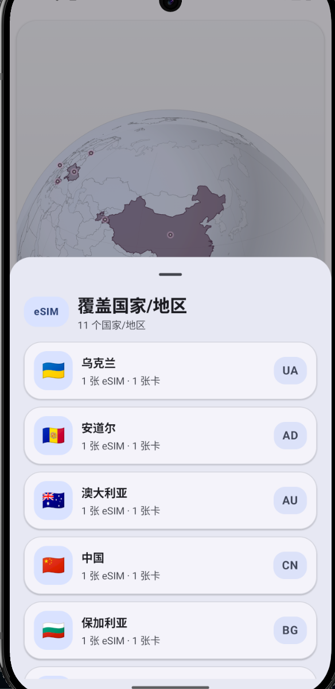
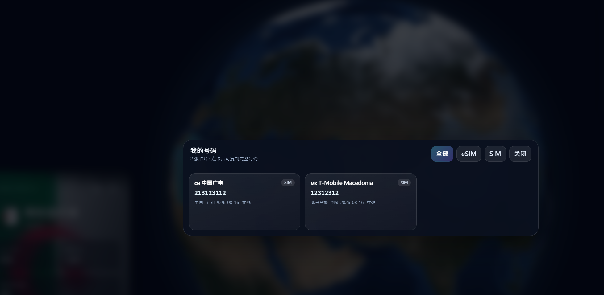

# DsimJ Preview

DsimJ — SIM 卡 & eSIM 全能管家。

爱用AI的Doro 维护的 DsimJ 是基于 SIMJ 项目进行二次开发（二改）的 Android 工具，面向号码保号 + eSIM 管理。预览版包含最新实验性功能。

## 预览

以下为示例预览图，不包含维护者服务器地址、真实号码或部署凭据。

<p align="center">
  
  
  
</p>

<p align="center">
  
  
</p>

<p align="center">
  
</p>

<p align="center">
  
</p>

## 开发接手

继续改 **App / 云端 / 3D 地球 / 管理后台** 请先读：

**→ [docs/DEVELOPMENT.md](docs/DEVELOPMENT.md)**（完整：架构、E2EE、全部 API、App/Web 模块、部署、踩坑）

**→ [docs/HANDOFF-CHECKLIST.md](docs/HANDOFF-CHECKLIST.md)**（5 分钟清单）

要点：云端号码 **用账号密码加解密**；**私钥只用于找回密码**。开源仓库不应包含任何真实服务器 IP、SSH 凭据、数据库或证书私钥。

云端服务目录：`server/simjiang-reminder/`。

## ⚠️ 升级提醒 (v3.0.24-pre)

> **更新前请先保存好 Key 和导出备份！**
>
> 现版本软件签名已更换（已获授权），兼容了更多的实体 eSIM 证书（当然能不能用看你买卡的运气）。

## 功能

- 📱 **号码保号管理** — 130+ 国家号码录入，智能到期提醒，批量管理
- 🌐 **eSIM 管理** — 内置 eSIM (OMAPI) + USB 实体卡双通道，扫码/相册/手动下载 Profile
- ☁️ **云端提醒** — Telegram Bot / SMTP 邮件 / 云端 API 同步 + 自建服务地址自定义
- 🛠️ **实用工具** — 刷流量测试、拨号测试、JSON/CSV 导入导出
- 🌙 **深色模式** — 全局适配
- 🌍 **多语言** — 简体中文、繁体中文、English、日本語、阿拉伯语 (RTL)
- 🔒 **本地存储** — 数据不上传，隐私安全
- 🚫 **零广告** — 纯工具，无打扰

## 构建

```bash
gradle assembleRelease --no-daemon --max-workers=1
```

开源仓库默认不包含维护者服务器地址、签名密钥、GitHub Release 检查仓库或任何部署凭据。

- 云同步地址：在 App 设置里填写自建后端，例如 `https://your-domain.example`。
- Release 检查：默认关闭；需要时通过 `simj.updateRepoOwner` / `simj.updateRepoName` 或 `SIMJ_UPDATE_REPO_OWNER` / `SIMJ_UPDATE_REPO_NAME` 注入。
- Release 签名：通过用户级 `~/.gradle/gradle.properties` 里的 `simj.signing.*` 或 `SIMJ_SIGNING_*` 环境变量注入，不要把 keystore、密码写进项目仓库。

## 下载

[Latest Release](https://github.com/Evelorion/simj-preview/releases)

---

## 云同步后端 — 自建教程

后端位于 [server/simjiang-reminder](server/simjiang-reminder)。完整搭建、VPS 推荐配置、HTTPS、备份、安全注意事项见：

**→ [server/simjiang-reminder/README.md](server/simjiang-reminder/README.md)**

简要要求：

| 项目 | 推荐 |
|------|------|
| 系统 | Debian 12 / Ubuntu 22.04+ |
| Python | 3.10+ |
| 端口 | 默认 8787，可用反代隐藏 |
| VPS | 1 vCPU / 1 GB RAM / 10 GB SSD 起步 |

服务端只保存密文 `encryptedVault` 和 coverage 元数据，不解密完整号码。App 端需要在云同步设置里填写自己的服务地址，例如 `https://your-domain.example` 或 `http://<your-server-ip>:8787`。
